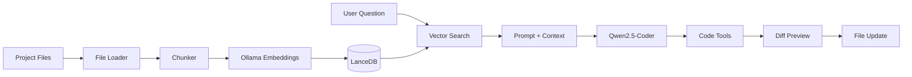

# code

Local RAG coding assistant powered by **Ollama** and **LanceDB**. Index any codebase, ask questions, and run an agent with tools — all on your machine.

**npm:** `@code.siddharth/code` · **CLI command:** `code`

> The unscoped name `code` is taken on npm. Install with the scoped package name — the command is still `code`.

No cloud API. No code leaving your laptop.

## Features

- **Local LLM** — Qwen2.5-Coder via Ollama
- **RAG pipeline** — scan → chunk → embed → store in LanceDB
- **Multi-project indexes** — each repo gets its own vector store; switch without re-indexing
- **Incremental sync** — only re-embeds changed files
- **Agent mode** — multi-step tool loop (read, grep, edit, git, AST references)
- **Plan mode** — read-only exploration, approaches + questions, then `/execute` to implement
- **Saved plans** — auto-save under `~/.code/projects/<id>/plans/`; resume with `/resume` or `--resume`
- **Simple RAG mode** — single-shot Q&A without the agent loop
- **Browser diff preview** — Claude-style review UI before applying writes/edits
- **Slash commands** — `/grep`, `/read`, `/edit`, `/projects`, and more
- **Conversation memory** — follow-up questions in chat

## Architecture

```
Project Files → File Loader → Chunker → Ollama Embeddings → LanceDB
                                                              ↓
User Question → Vector Search → Relevant Chunks → Prompt + Context
                                                              ↓
                              Local LLM → Tools → Diff Review → Apply
```



## Prerequisites

- [Node.js](https://nodejs.org/) 18+
- [Ollama](https://ollama.com/) running locally

Pull the required models:

```bash
ollama pull qwen2.5-coder:14b
ollama pull nomic-embed-text
```

## Installation

### From source

```bash
git clone https://github.com/siddharth17vaishnav/code.git
cd code
npm install
npm run build
```

### As a global CLI

```bash
npm install -g @code.siddharth/code
```

Then run **`code`** anywhere (the command name, not the scoped package name):

```bash
code index ./my-app
code chat ./my-app
code query ./my-app "How does routing work?"
code --help
```

> **Note:** If you have VS Code installed, its `code` command may conflict. Use `npx @code.siddharth/code` or rename the VS Code alias instead.

### Build the package

```bash
npm run build          # compile to dist/
npm pack               # create package tarball
```

Copy `.env.example` to `.env` and edit as needed:

```bash
cp .env.example .env
```

```env
# Optional — defaults to current directory if omitted
PROJECT_PATH=D:\path\to\your\project

# Optional — override user data directory (default: ~/.code)
# CODE_HOME=D:\path\to\custom-code-home

OLLAMA_BASE_URL=http://localhost:11434
LLM_MODEL=qwen2.5-coder:14b
EMBED_MODEL=nomic-embed-text
```

`PROJECT_PATH` is optional. If you omit it, pass the project on the CLI or run commands from inside the repo.

## Quick Start

```bash
# 1. Index a project
npm run index -- D:\path\to\your\project

# 2. Chat with the agent (from inside the repo, path is optional)
cd D:\path\to\your\project
npm run chat

# 3. Plan mode — explore read-only, then /execute
npm run chat:plan -- D:\path\to\your\project

# 4. Resume a saved plan
npm run chat:plan:resume -- D:\path\to\your\project

# 5. One-shot question (no agent loop)
npm run query -- D:\path\to\your\project "How does routing work?"
```

## Project Path

The target codebase can be passed as a CLI argument, via `--project`, set in `.env`, or omitted to use the **current working directory**:

```bash
npm run chat                              # uses cwd
npm run chat -- D:\Projects\MyApp
npm run chat -- --project ../my-app
npm run index -- -p ./portfolio
```

With npm, put a `--` before script arguments so npm does not swallow flags like `--project` or `--resume`:

```bash
npm run chat:plan -- --resume ./my-app
npm run index -- --project ./my-app
```

## Scripts

Development (TypeScript directly via tsx):

| Command | Description |
|---------|-------------|
| `npm run build` | Compile TypeScript to `dist/` |
| `npm run test` | Run unit tests |
| `npm run index` | Incremental index sync |
| `npm run index:full` | Full rebuild of the index |
| `npm run chat` | Interactive agent chat (default) |
| `npm run chat:simple` | Single-shot RAG mode |
| `npm run chat:plan` | Plan mode — read-only exploration, then `/execute` |
| `npm run chat:plan:resume` | Plan mode + pick a saved plan on startup |
| `npm run chat:watch` | Chat + auto re-index on file changes |
| `npm run query` | One-shot question from the terminal |
| `npm run watch` | Watch files and re-index on changes |
| `npm run dev` | List loaded project files (smoke test) |

Production (compiled CLI):

```bash
code chat ./my-app
code chat --plan --resume ./my-app
code index ./my-app --full
```

### Flags

| Flag | Description |
|------|-------------|
| `--project <path>` / `-p` | Target codebase path (default: current directory) |
| `--plan` | Start in plan mode (read-only exploration) |
| `--resume` | Pick a saved plan on startup (plan mode) |
| `--simple` | RAG mode instead of agent |
| `--watch` | Auto-sync index on file changes |
| `--no-ui` | Terminal-only diff preview (skip browser) |
| `--full` | Force full index rebuild |

## Plan Mode

Plan mode works like Cursor or Claude Code planning: explore the codebase read-only, discuss approaches, produce a plan, then implement it.

**Phases**

1. **Discovery** — inspect files with read-only tools, present approaches and questions
2. **Finalize** — produce a structured plan with steps and proposed changes
3. **Execute** — run `/execute` to switch to agent mode and implement the plan

**Workflow**

```bash
npm run chat:plan -- ./my-app
# Describe what you want → answer questions → /finalize if needed → /execute
```

Follow-up prompts **update the current plan** — they do not restart discovery. Plans auto-save after each turn.

**Saved plans**

Plans are stored per project under your user data directory:

| Platform | Default location |
|----------|------------------|
| Windows | `%USERPROFILE%\.code\projects\<hash>\plans\` |
| macOS / Linux | `~/.code/projects/<hash>/plans/` |

```
~/.code/
  projects.json
  projects/
    <hash>/
      plans/
        <plan-id>/
          session.json
          plan.md
```

Override with `CODE_HOME` in `.env` if needed.

Use `/plans` to list saved plans, `/resume` to pick one and continue, or start with `--resume`:

```bash
npm run chat:plan:resume -- ./my-app
code chat --plan --resume ./my-app
```

Export a plan to a file with `/save [path]` (default: `./plan.md`).

If a model response fails to update the plan (e.g. a generic refusal), the previous saved plan is kept and recovered on resume from `plan.md` or chat history.

## Chat Commands

Inside `npm run chat`:

| Command | Description |
|---------|-------------|
| `/help` | Show available commands |
| `/clear` | Clear conversation memory |
| `/read <path>` | Read a file with line numbers |
| `/write <path>` | Write a file (multiline, end with `---`) |
| `/edit <path> <start> <end>` | Replace a line range |
| `/grep <pattern>` | Regex search across the codebase |
| `/find <symbol>` | Find definitions (function, class, type) |
| `/refs <symbol>` | Find all references via AST |
| `/imports <path>` | List imports in a file |
| `/importers <path>` | Find files that import a module |
| `/git` | Git status and diff summary |
| `/projects` | List all indexed projects |
| `/reindex` | Run incremental index sync |
| `/plan` | Switch to plan mode (starts a new plan) |
| `/agent` | Switch to agent mode (can edit files) |
| `/finalize` | Produce final plan from current discussion |
| `/save [path]` | Export plan to markdown (default: `./plan.md`) |
| `/plans` | List saved plans for this project |
| `/resume` | Pick a saved plan and continue |
| `/execute` | Implement the last plan (after it is ready) |
| `exit` / `quit` | Exit chat |

## Agent Tools

In agent mode, the LLM can call these tools automatically:

| Tool | Description |
|------|-------------|
| `search_codebase` | Semantic search over the index |
| `read_file` | Read a project file |
| `grep` | Regex search |
| `find_symbol` | Find symbol definitions |
| `find_references` | AST reference search |
| `list_imports` | Imports in a file |
| `find_importers` | Files importing a module |
| `git_status` | Git status and recent diff |
| `edit_file` | Replace a line range |
| `write_file` | Write or overwrite a file |

Mutating tools (`edit_file`, `write_file`) open a **browser diff preview** for approval before applying. In plan mode, only read-only tools are available until you run `/execute`.

Preview server runs at `http://127.0.0.1:3847`. Use `--no-ui` to fall back to terminal `y/N`.

## Index Storage

Indexes, manifests, and saved plans live in a **user-level data directory**, not inside your project repo:

| Platform | Default path |
|----------|--------------|
| Windows | `C:\Users\<you>\.code\` |
| macOS / Linux | `~/.code/` |

```
~/.code/
  projects.json
  projects/
    <hash>/
      manifest.json    # file mtimes for incremental sync
      lancedb/         # vector embeddings
      plans/           # saved plan sessions (plan mode)
        index.json
        <plan-id>/
          session.json
          plan.md
```

On first run, if a legacy `./storage` folder exists in the current working directory, it is moved into `~/.code` automatically.

Set `CODE_HOME` in `.env` to use a custom location.

Switch between indexed projects instantly — no full rebuild unless files changed.

```
npm run index -- D:\Projects\App-A
npm run index -- D:\Projects\App-B
npm run chat -- D:\Projects\App-A   # uses App-A index
npm run chat -- D:\Projects\App-B   # uses App-B index
```

## Project Structure

```
src/
├── cli/           # Entry points (chat, index, query, watch)
├── core/          # Config, types, CLI args, project storage
├── indexing/      # Loader, chunker, embedder, LanceDB, sync
├── retrieval/     # Vector search + context assembly
├── llm/           # Ollama client and prompt builder
├── agent/         # Agent loop, plan mode, plan storage, session memory
├── tools/         # Read, write, grep, git, AST tools
└── preview/       # Browser diff review UI
```

## Tech Stack

| Layer | Technology |
|-------|------------|
| Runtime | TypeScript, Node.js |
| LLM | Ollama (Qwen2.5-Coder) |
| Embeddings | Ollama (nomic-embed-text) |
| Vector DB | LanceDB |
| AST analysis | ts-morph |
| File scanning | fast-glob |

## License

ISC
